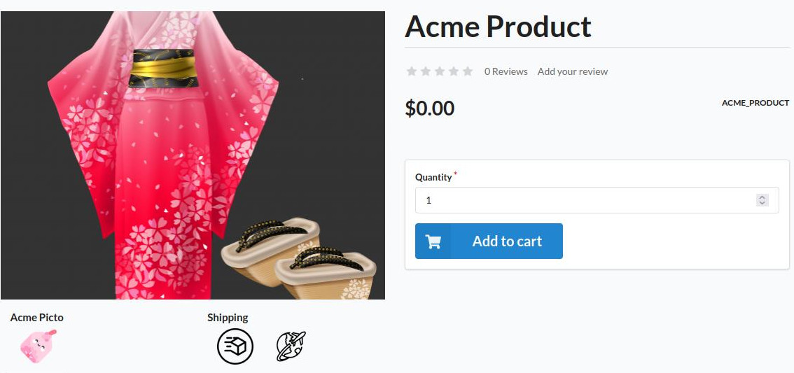

<p align="center">
</p>


<h1 align="center">Asdoria Pictogram Bundle</h1>

<p align="center">A plugin to create, group and associate documents with products</p>

## Features

+ Create type of documents 
+ Easily customize which documents to display from the product configuration page
+ Document are automatically displayed on the product's store page

<div style="max-width: 75%; height: auto; margin: auto">



</div>


<div style="max-width: 75%; height: auto; margin: auto">

Toggling the documents to display for a product


</div>


## Installation

---
1. Add the repository to composer.json

```JSON
"repositories": [
    {
        "type": "git",
        "url": "https://github.com/asdoria/AsdoriaSyliusProductDocumentPlugin.git"
    }
],
```
2. run `composer require asdoria/sylius-product-document-plugin`


3. Add the bundle in `config/bundles.php`. You must put it ABOVE `SyliusGridBundle`

```PHP
Asdoria\SyliusPictogramPlugin\AsdoriaSyliusProductDocumentPlugin::class => ['all' => true],
[...]
Sylius\Bundle\GridBundle\SyliusGridBundle::class => ['all' => true],
```

4. Import routes in `config/routes.yaml`

```yaml
asdoria_product_document:
    resource: "@AsdoriaSyliusProductDocumentPlugin/Resources/config/routing.yaml"
```

5. Import config in `config/packages/_sylius.yaml`
```yaml
imports:
    - { resource: "@AsdoriaSyliusProductDocumentPlugin/Resources/config/config.yaml"}
```
6. In `src/Entity/Product/Product.php`. Import `Asdoria\SyliusPictogramPlugin\Traits\PictogramsTrait` and initialize a document collection in the constructor

```PHP

// ...

use Asdoria\SyliusProductDocumentPlugin\Model\Aware\ProductDocumentsAwareInterface;
use Asdoria\SyliusProductDocumentPlugin\Traits\ProductDocumentsTrait;

/**
 * @ORM\Entity
 * @ORM\Table(name="sylius_product")
 */
class Product extends BaseProductimplements implements ProductDocumentsAwareInterface
{
    use ProductDocumentsTrait;

    public function __construct()
    {
        parent::__construct();
        $this->initializeProductDocumentsCollection();
    }

    /**
     * @param ProductDocumentInterface $productDocument
     */
    public function addProductDocument(ProductDocumentInterface $productDocument): void
    {
        if (!$this->hasProductDocument($productDocument)) {
            $productDocument->setProduct($this);
            $this->productDocuments->add($productDocument);
        }
    }

    /**
     * @param ProductDocumentInterface $productDocument
     */
    public function removeProductDocument(ProductDocumentInterface $productDocument): void
    {
        if ($this->hasProductDocument($productDocument)) {
            $productDocument->setProduct(null);
            $this->productDocuments->removeElement($productDocument);
        }
    }
    ...
}
```
7. run `php bin/console do:mi:mi` to update the database schema

8. Add to Product xml mapping
```XML
<one-to-many field="productDocuments" target-entity="Asdoria\SyliusProductDocumentPlugin\Model\ProductDocumentInterface" mapped-by="product" orphan-removal="true">
    <cascade>
        <cascade-all/>
    </cascade>
</one-to-many>
```

## Usage

1. In the back office, under `Catalog`, enter `Document Types`. Create a type of document using a unique code
2. In `Document Types`, click `Managing Document Type` to create/delete type for this group
3. Go to a product's edit page, then click the `Documents` tab in the sidebar. Here you can upload which documents you wish to display


