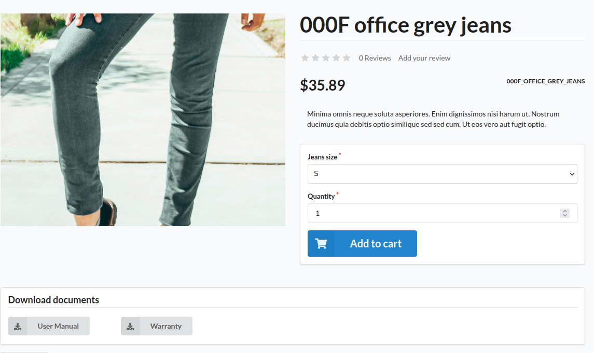
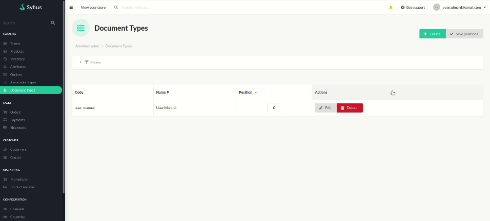

<p align="center">
</p>


<h1 align="center">Asdoria Product Document Plugin</h1>

<p align="center">A plugin to create, group and associate documents with products</p>

## Features

+ Create type of documents 
+ Easily customize which documents to display from the product configuration page
+ Document are automatically displayed on the product's store page and downloaded there

<div style="max-width: 75%; height: auto; margin: auto">



</div>


<div style="max-width: 75%; height: auto; margin: auto">

Creating a document type and customizing its content in the product edit page.


</div>

## Installation

1. run `composer require asdoria/sylius-product-document-plugin`

2. Add the bundle in `config/bundles.php`. You must put it ABOVE `SyliusGridBundle`

```PHP
Asdoria\SyliusProductDocumentPlugin\AsdoriaSyliusProductDocumentPlugin::class => ['all' => true],
[...]
Sylius\Bundle\GridBundle\SyliusGridBundle::class => ['all' => true],
```

3. Import routes in `config/routes.yaml`

```yaml
asdoria_product_document:
    resource: "@AsdoriaSyliusProductDocumentPlugin/Resources/config/routing.yaml"
```

4. Import config in `config/packages/_sylius.yaml`
```yaml
imports:
    - { resource: "@AsdoriaSyliusProductDocumentPlugin/Resources/config/app/config.yaml"}
```
5. In `src/Entity/Product/Product.php`. Import the following classes, traits and methods.

```PHP
use Asdoria\SyliusProductDocumentPlugin\Model\Aware\ProductDocumentsAwareInterface;
use Asdoria\SyliusProductDocumentPlugin\Model\ProductDocumentInterface;
use Asdoria\SyliusProductDocumentPlugin\Traits\ProductDocumentsTrait;
use Sylius\Component\Product\Model\ProductTranslationInterface;

class Product extends BaseProduct implements  ProductDocumentsAwareInterface
{
    use ProductDocumentsTrait;

    public function __construct()
    {
        parent::__construct();
        $this->initializeProductDocumentsCollection();
    }
    
    /**
     * @param ProductDocumentInterface $productDocument
     */
    public function addProductDocument(ProductDocumentInterface $productDocument): void
    {
        if (!$this->hasProductDocument($productDocument)) {
            $productDocument->setProduct($this);
            $this->productDocuments->add($productDocument);
        }
    }

    /**
     * @param ProductDocumentInterface $productDocument
     */
    public function removeProductDocument(ProductDocumentInterface $productDocument): void
    {
        if ($this->hasProductDocument($productDocument)) {
            $productDocument->setProduct(null);
            $this->productDocuments->removeElement($productDocument);
        }
    }    
}
```
6. run `php bin/console do:mi:mi` to update the database schema


7. Add to Product XML mapping (`Sylius/Bundle/ProductBundle/Resources/config/doctrine/model/Product.orm.xml`)
```XML
<one-to-many field="productDocuments" target-entity="Asdoria\SyliusProductDocumentPlugin\Model\ProductDocumentInterface" mapped-by="product" orphan-removal="true">
    <cascade>
        <cascade-all/>
    </cascade>
</one-to-many>
```

## Usage

1. In the back office, under `Catalog`, enter `Document Types`. Create a type of document using a unique code. 
2. Go to a product's edit page, then click the `Documents` tab in the sidebar. Here you can add documents type then upload which document you wish to display for each.


